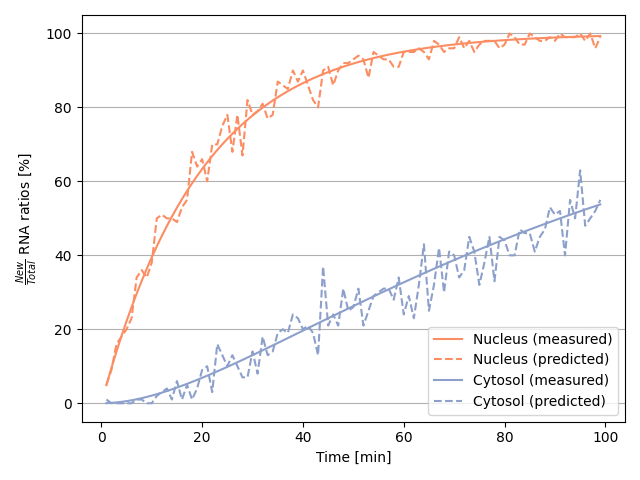
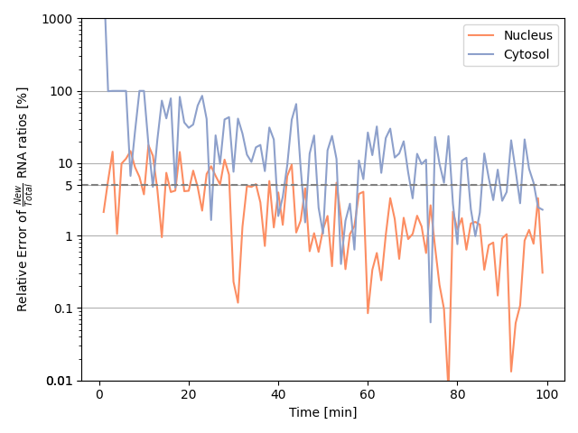

# Simulating a two-compartment model of RNA metabolism

This model simulates the RNA metabolism of a eukaryotic cell using a simple two-compartment model as described in [Müller et al. (2024)](https://journals.plos.org/ploscompbiol/article?id=10.1371/journal.pcbi.1012059). Typically, protocols that apply 4sU labeling protocols (such as [SLAM-seq](https://www.nature.com/articles/nmeth.4435)) are used to generate time series of RNA expression levels from which the underlying transcript dynamics can be inferred. The problem is that 4sU incorporation rate is very low (roughly [2%](https://www.nature.com/articles/nmeth.4435)), so many newly synthesized transcripts escape the labeling process. Therefore, naive counts of labeled transcripts are poor targets for a dynamic model, as the downstream metabolic rates would be significantly underestimated. Fortunately, this problem can be mitigated by adjusting experimental parameters such as coverage (library size) and sequencing read length. To get an idea of which experimental parameters lead to the desired precision of RNA metabolic parameters, this model can be used.

Make sure that you have installed `numpy`, `scipy`, `matplotlib`, `seaborn` and `pyyaml`. Then you can configure the `parameter.yml` file in the `docs/` folder. The yaml file looks like this:


```yaml
---
    mu: 1 # synthesis rate
    tau: 0.05 # nuclear export rate
    nu: 0.0001 # nuclear degradation rate
    lam: 0.01 # cytosolic degradation rate
    readlength: 75 # read length in bp
    coverage: 100 # a decent number of reads per transcript
    labelingefficiency: 0.02 # 2% is a literature value (Herzog et al. (2017))
    times: [1, 100, 1] # format: start time, end time, step size
...
```
Having specified the parameters, you can call the `main.py` script:

```console
user@foo:~$ python main.py
```

The script then calculates the actual proportions of the newly synthesized transcripts and the corresponding estimates. For simplicity, an output folder named `data/` is created by default with two different graphs. The first graph shows the New/Total RNA ratios over time for both the nucleus and the cytosol:

<p align="center">
  <a href="https://computationalbiology.uni-koeln.de/">
    
  </a>
</p>

The second graph shows the corresponding relative errors of the New/Total RNA ratio estimates for both the nucleus and the cytosol.

<p align="center">
  <a href="https://computationalbiology.uni-koeln.de/">
    
  </a>
</p>

However, the user can call up the resulting model object for further downstream analyses. The model is saved as the pickle `model.pkl` in the `data/` folder.